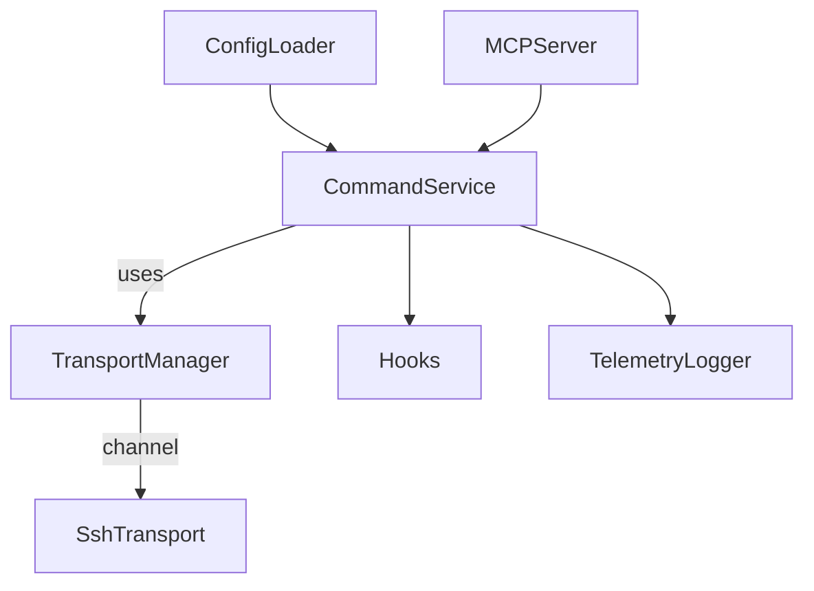

# Design Document

## Overview
The remote-server-mcp project will expose a Model Context Protocol (MCP) server that allows an AI agent to execute shell commands on pre-configured remote hosts. The design emphasizes simple setup, per-command isolation, and clean telemetry so that future guardrails can be layered in without refactoring core command execution.

## Steering Document Alignment

### Technical Standards (tech.md)
No steering documents exist yet; we adopt de-facto standards suitable for MCP tooling: TypeScript-based implementation, explicit typing, dependency injection for transports, and structured logging.

### Project Structure (structure.md)
We follow a conventional src/ layout with domain-specific subfolders (`config`, `transport`, `services`, `hooks`, `logging`). Configuration files live under `~/.config/remote-server-mcp/` by default, while the repository holds code, tests, and documentation.

## Code Reuse Analysis
This is a greenfield codebase. We will rely on proven OSS packages rather than in-repo reuse.

### Existing Components to Leverage
- **ssh2 (npm)**: Provides SSH client functionality, including exec channels and connection pooling.
- **zod (npm)**: Schema validation for configuration files.
- **winston/pino**: Structured logging sinks.
- **yaml/toml parser**: Parse configuration into typed objects.

### Integration Points
- **Local filesystem**: Load configuration and known hosts.
- **OS key management**: Reuse existing SSH keys or agent sockets.

## Architecture

We split the system into four primary layers:

1. **Configuration Layer**: Loads, validates, and hot-reloads server definitions from `config.toml` (alias, host, port, auth, defaults).
2. **Transport Layer**: Provides an abstract `RemoteTransport` interface with an SSH implementation (`SshTransport`) that manages connection reuse and per-command channels.
3. **Command Service**: Implements the MCP tool `runCommand`, orchestrating config lookup, transport requests, timeout handling, streaming responses, and telemetry emission.
4. **Observability & Hooks**: `TelemetryLogger` writes structured audit events; `ExecutionHooks` exposes pre/post no-op hooks to be extended later.



### Modular Design Principles
- **Single File Responsibility**: each module handles one concern (e.g., `config/loader.ts`, `transport/ssh.ts`).
- **Component Isolation**: command execution does not parse config or manage sockets directly; transport-specific logic stays behind interfaces.
- **Service Layer Separation**: MCP server routes requests into `CommandService`; output formatting happens centrally.
- **Utility Modularity**: helpers like timeout controllers, retry policies, and output stream transformers live in `src/utils`.

## Components and Interfaces

### ConfigLoader
- **Purpose:** Load and validate remote host configuration from disk (TOML/YAML).
- **Interfaces:** `load(): Promise<Config>`; `watch(onReload)`; `getHost(alias)`.
- **Dependencies:** file system, zod schema parser.
- **Reuses:** zod for validation, chokidar for file watching.

### TransportManager / RemoteTransport
- **Purpose:** Abstract transport creation/reuse and provide per-command channels.
- **Interfaces:** `execute(hostConfig, command, options): Promise<ExecutionResult>`; `stream(hostConfig, command, options, onChunk)`.
- **Dependencies:** ssh2 client, node streams.
- **Reuses:** `ssh2` for SSH implementation.

### CommandService
- **Purpose:** Implement MCP `runCommand` tool logic (validate request, route to transport, handle timeouts, emit telemetry).
- **Interfaces:** `handleRunCommand(request): AsyncGenerator<RunCommandResponse>` (supports streaming) + helper methods.
- **Dependencies:** ConfigLoader, TransportManager, ExecutionHooks, TelemetryLogger.

### ExecutionHooks
- **Purpose:** Provide pre- and post-execution extension points (no-op defaults).
- **Interfaces:** `beforeExecute(ctx)`, `afterExecute(ctx, result)` returning promises.
- **Dependencies:** none initially.

### TelemetryLogger
- **Purpose:** Emit structured audit logs to file/stdout and expose counters for future metrics.
- **Interfaces:** `logCommandStart(ctx)`, `logCommandEnd(ctx, result)`, `logError(ctx, error)`.
- **Dependencies:** winston/pino, file system.

### MCP Server Bootstrap
- **Purpose:** Wire components, register tools with the MCP runtime, handle graceful shutdown and hot-reload triggers.
- **Interfaces:** `bootstrap()` entry, signal handlers.
- **Dependencies:** `@modelcontextprotocol/sdk` (or preferred MCP server framework).

## Data Models

### Config Schema (TypeScript)
```ts
export interface HostConfig {
  alias: string;
  host: string;
  port?: number;
  username: string;
  auth: {
    type: 'ssh-key' | 'ssh-agent' | 'credential-command';
    privateKeyPath?: string;
    passphrasePrompt?: boolean;
    credentialCommand?: string;
  };
  defaultShell?: string;
  workingDirectory?: string;
  knownHostsPath?: string;
  strictHostKeyChecking?: boolean;
  connection?: {
    keepAliveIntervalMs?: number;
    maxPoolSize?: number;
  };
}
```

### RunCommand Request/Result
```ts
export interface RunCommandRequest {
  hostAlias: string;
  command: string;
  timeoutMs?: number;
  stream?: boolean;
}

export interface CommandChunk {
  type: 'stdout' | 'stderr';
  data: string;
  timestamp: string;
}

export interface RunCommandResult {
  exitCode: number | null;
  stdout: string;
  stderr: string;
  timedOut: boolean;
  durationMs: number;
}
```

### Telemetry Event
```ts
export interface CommandAuditEvent {
  id: string;
  timestamp: string;
  hostAlias: string;
  commandSummary: string;
  timeoutMs: number;
  status: 'started' | 'succeeded' | 'failed' | 'timed-out';
  exitCode?: number;
  durationMs?: number;
  errorMessage?: string;
}
```

## Error Handling

### Error Scenarios
1. **Invalid configuration entry**
   - **Handling:** validation error thrown during load; bootstrap refuses to start; log with remediation hint.
   - **User Impact:** MCP initialization fails with descriptive message referencing alias and missing fields.

2. **SSH authentication failure**
   - **Handling:** attempt configured retries with exponential backoff; if still failing, raise structured MCP error (`auth_failed`) including root cause.
   - **User Impact:** AI receives error payload detailing host alias and reason; no command executed.

3. **Command timeout**
   - **Handling:** cancel remote channel, send timeout telemetry, flag `timedOut: true` in result.
   - **User Impact:** AI sees command timed out and partial output if available.

4. **Transport disconnection mid-stream**
   - **Handling:** attempt reconnect + rerun if idempotent? For now, abort run, log `transport_disconnected`, bubble failure.
   - **User Impact:** AI notified of disconnect; future iterations may add retry policies.

## Testing Strategy

### Unit Testing
- Test `ConfigLoader` validation and hot-reload behavior using fixture files.
- Mock `RemoteTransport` to verify `CommandService` handles timeouts, streaming, and hook invocation.
- Validate hook no-ops and telemetry logging format.

### Integration Testing
- Spin up an ephemeral SSH server (e.g., `gliderlabs/ssh` or `docker sshd`) in CI to run end-to-end command execution tests, including success, auth failure, and timeout scenarios.
- Ensure audit logs are emitted and rotation works.

### End-to-End Testing
- Use MCP client harness to call the exposed `runCommand` tool against a known host, verifying streaming responses and structured results.
- Manual smoke test with real SSH target prior to release.
